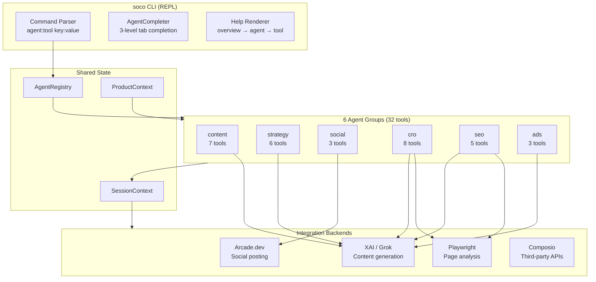

# soco — Marketing CLI

A unified marketing command-line tool that consolidates 32 marketing skills across 6 agent groups into a single `agent:tool` interface. Built for SaaS teams that want AI-powered marketing without leaving the terminal.

```
soco> content:copywriting topic:"SaaS landing page" tone:professional
soco> seo:audit url:https://tendly.eu
soco> social:post channel:x content:"New feature!"
```

## Architecture



## Quick Start

### Prerequisites

- Python 3.12+
- API keys (see [Configuration](#configuration))

### Install

```bash
git clone https://github.com/tendlyeu/soco.git
cd soco
python -m venv .venv
source .venv/bin/activate
pip install -r requirements.txt
```

### Configure

```bash
cp .env.sample .env
# Edit .env with your API keys
```

### Launch

```bash
python soco.py          # starts the marketing CLI (default)
```

## Command Syntax

```
agent:tool key:value key:"multi word value"
```

First token is `agent:tool`, remaining tokens are `key:value` arguments. Quoted values support spaces.

### Builtins

| Command | Description |
|---------|-------------|
| `help` | Show all agents |
| `help <agent>` | Show agent's tools |
| `help <agent:tool>` | Show tool details and parameters |
| `agents` | List all agents with tool counts |
| `context` | Show current product context |
| `history` | Show command history |
| `clear` | Clear screen |
| `exit` | Exit soco |

## Agent Groups

| Agent | Tools | Integration | Description |
|-------|------:|-------------|-------------|
| **content** | 7 | XAI/Grok | Copywriting, email sequences, ad creative, content strategy |
| **strategy** | 6 | XAI/Grok | Launch planning, pricing, referral programs, marketing psychology |
| **social** | 3 | Arcade.dev | Post to X/LinkedIn, scheduling, analytics |
| **cro** | 8 | Playwright + XAI | Page analysis, signup flows, form CRO, churn prevention |
| **seo** | 5 | Playwright + XAI | Technical audits, schema markup, AI SEO, competitor analysis |
| **ads** | 3 | XAI + Composio | Campaign strategy, A/B testing, analytics tracking |

See [docs/skills_readme.md](docs/skills_readme.md) for the full skills reference, [docs/tools_readme.md](docs/tools_readme.md) for detailed tool documentation, and the [marketing skills repo](https://github.com/coreyhaines31/marketingskills/tree/main/tools) for the underlying tool prompts.

## Examples

```bash
# Generate marketing copy
soco> content:copywriting topic:"SaaS landing page hero" format:headline

# Set product context (shared across all agents)
soco> strategy:product-context set company:Tendly product:"Tender platform" audience:"procurement teams"

# SEO audit a page
soco> seo:audit url:https://tendly.eu

# Post to social media (with dry run)
soco> social:post channel:x content:"Exciting launch!" dry-run:true

# Analyze a page for conversions
soco> cro:page-cro url:https://example.com/pricing

# Design an A/B test
soco> ads:ab-test page:"pricing page" hypothesis:"Annual toggle increases conversions"

# Get marketing ideas
soco> strategy:ideas topic:"user acquisition" count:10
```

## Project Structure

```
soco/
├── soco.py                          # CLI entry point (default: marketing REPL)
├── tui_main.py                      # REPL launcher
├── tui/
│   ├── app.py                       # SocoApp — REPL, completer, routing
│   └── components/
│       ├── command_processor.py      # agent:tool parser
│       └── social_handler.py        # Legacy TUI handler
├── agents/
│   ├── base.py                      # BaseAgent ABC, ToolResult, ToolDefinition
│   ├── registry.py                  # AgentRegistry singleton
│   ├── content/__init__.py          # ContentAgent (7 tools)
│   ├── strategy/__init__.py         # StrategyAgent (6 tools)
│   ├── social/__init__.py           # SocialAgent (3 tools)
│   ├── cro/__init__.py              # CroAgent (8 tools)
│   ├── seo/__init__.py              # SeoAgent (5 tools)
│   ├── ads/__init__.py              # AdsAgent (3 tools)
│   ├── generate_content.py          # Legacy: batch content generation
│   ├── review_content.py            # Legacy: interactive review
│   ├── post_content.py              # Legacy: DB-backed posting
│   ├── run_pipeline.py              # Legacy: generate→review→post
│   └── interactive_pipeline.py      # Legacy: step-by-step pipeline
├── integrations/
│   ├── base.py                      # IntegrationBackend ABC
│   ├── xai_int.py                   # XAI/Grok (OpenAI client → x.ai)
│   ├── arcade_int.py                # Arcade.dev (arcadepy SDK)
│   ├── playwright_int.py            # Playwright (async browser)
│   └── composio_int.py              # Composio (stub)
├── context/
│   └── session.py                   # SessionContext + ProductContext
├── help/
│   └── renderer.py                  # 3-level Rich help renderer
├── utils/
│   ├── social_poster.py             # ArcadeSocialPoster
│   ├── summarizer.py                # TenderSummarizer (XAI)
│   ├── tendly_scraper.py            # Playwright scraper
│   └── langchain_sql.py             # Database utilities
└── docs/
    ├── skills_readme.md             # Full skills reference
    └── tools_readme.md              # Detailed tool documentation
```

## Configuration

Copy `.env.sample` to `.env` and set:

| Variable | Required | Description |
|----------|----------|-------------|
| `XAI_API_KEY` | Yes | XAI/Grok API key ([console.x.ai](https://console.x.ai)) |
| `ARCADE_API_KEY` | For social | Arcade.dev API key ([arcade.dev](https://arcade.dev)) |
| `ARCADE_USER_ID` | For social | Arcade user ID (typically your email) |
| `XAI_MODEL` | No | Model name (default: `grok-3`) |
| `COMPOSIO_API_KEY` | No | Composio API key for GA4, Mailchimp, etc. |
| `DB_URL` | For legacy | PostgreSQL connection string |

### Integration Status

On startup, soco shows which integrations are ready:

```
  6 agents, 32 tools loaded
  Integrations: xai: ready | arcade: ready | playwright: ready | composio: not configured
```

## Legacy Commands

The original tender pipeline commands still work:

```bash
python soco.py generate    # Generate social content from tenders
python soco.py review      # Review and approve draft posts
python soco.py post        # Post approved content
python soco.py pipeline    # Full generate→review→post pipeline
python soco.py run         # Interactive step-by-step pipeline
python soco.py web         # Streamlit dashboard
```

## Tech Stack

- **Python 3.12** with asyncio
- **prompt_toolkit** — REPL with history, completion, key bindings
- **Rich** — terminal formatting and help rendering
- **XAI/Grok** — content generation via OpenAI-compatible API
- **Arcade.dev** — social media posting (X, LinkedIn)
- **Playwright** — headless browser for page analysis
- **Composio** — third-party API integrations (GA4, Mailchimp, Semrush)
- **PostgreSQL** — post storage (legacy pipeline)

## Support

- **Email**: info@tendly.eu
- **Website**: [tendly.eu](https://www.tendly.eu)

## License

Proprietary software owned by Tendly. All rights reserved.

---

**Version**: 2.0.0
**Maintainer**: Tendly Development Team
