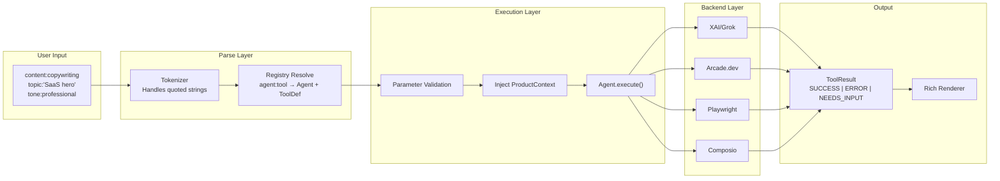

# soco Skills Reference

Complete reference for all 32 marketing skills organized across 6 agent groups.

## Architecture Flow



## Agent Overview

```mermaid
graph TD
    SOCO["soco CLI"]

    SOCO --> CONTENT["content (7)"]
    SOCO --> STRATEGY["strategy (6)"]
    SOCO --> SOCIAL["social (3)"]
    SOCO --> CRO["cro (8)"]
    SOCO --> SEO["seo (5)"]
    SOCO --> ADS["ads (3)"]

    CONTENT --> C1["copywriting"]
    CONTENT --> C2["copy-editing"]
    CONTENT --> C3["social-content"]
    CONTENT --> C4["email-sequence"]
    CONTENT --> C5["cold-email"]
    CONTENT --> C6["ad-creative"]
    CONTENT --> C7["content-strategy"]

    STRATEGY --> S1["launch"]
    STRATEGY --> S2["pricing"]
    STRATEGY --> S3["referral"]
    STRATEGY --> S4["product-context"]
    STRATEGY --> S5["ideas"]
    STRATEGY --> S6["psychology"]

    SOCIAL --> SO1["post"]
    SOCIAL --> SO2["schedule"]
    SOCIAL --> SO3["analytics"]

    CRO --> CR1["page-cro"]
    CRO --> CR2["signup-flow"]
    CRO --> CR3["onboarding"]
    CRO --> CR4["form-cro"]
    CRO --> CR5["popup-cro"]
    CRO --> CR6["paywall-upgrade"]
    CRO --> CR7["churn-prevention"]
    CRO --> CR8["free-tool-strategy"]

    SEO --> SE1["audit"]
    SEO --> SE2["programmatic"]
    SEO --> SE3["ai-seo"]
    SEO --> SE4["schema-markup"]
    SEO --> SE5["competitor-alternatives"]

    ADS --> A1["paid-ads"]
    ADS --> A2["ab-test"]
    ADS --> A3["analytics-tracking"]

    style CONTENT fill:#4A90D9
    style STRATEGY fill:#7B68EE
    style SOCIAL fill:#E91E63
    style CRO fill:#FF9800
    style SEO fill:#4CAF50
    style ADS fill:#FF5722
```



---

## content — Content Creation & Copywriting

7 tools powered by XAI/Grok for generating marketing content.

### copywriting
Generate marketing copy for any format (headlines, landing pages, CTAs).

| Parameter | Required | Default | Options |
|-----------|----------|---------|---------|
| `topic` | Yes | — | — |
| `format` | No | paragraph | headline, paragraph, bullet, cta |
| `tone` | No | professional | professional, casual, urgent, friendly |
| `platform` | No | web | web, email, social |

```
content:copywriting topic:"SaaS landing page hero" format:headline
content:copywriting topic:"Feature announcement" tone:casual
```

### copy-editing
Review and improve existing copy for clarity, persuasion, and conciseness.

| Parameter | Required | Default | Options |
|-----------|----------|---------|---------|
| `input` | Yes | — | — |
| `goal` | No | all | clarity, persuasion, conciseness, all |

```
content:copy-editing input:"Our product helps businesses grow faster with AI."
content:edit input:"Sign up now" goal:persuasion
```

### social-content
Platform-optimized social media posts (X: 280ch, LinkedIn: long-form).

| Parameter | Required | Default | Options |
|-----------|----------|---------|---------|
| `topic` | Yes | — | — |
| `platform` | No | x | x, linkedin, both |
| `tone` | No | professional | — |

```
content:social-content platform:x topic:"product launch"
content:social-content platform:both topic:"hiring announcement"
```

### email-sequence
Multi-step email drip sequences with subject lines and timing.

| Parameter | Required | Default | Options |
|-----------|----------|---------|---------|
| `type` | No | onboarding | onboarding, nurture, retention, upsell, reactivation |
| `topic` | No | — | — |
| `steps` | No | 5 | — |

```
content:email-sequence type:onboarding steps:5
content:email topic:"trial expiring" type:retention steps:3
```

### cold-email
B2B prospecting email sequences with personalization placeholders.

| Parameter | Required | Default | Options |
|-----------|----------|---------|---------|
| `target` | Yes | — | — |
| `product` | No | — | — |
| `steps` | No | 3 | — |
| `tone` | No | professional | — |

```
content:cold-email target:"SaaS CTOs" product:"analytics platform" steps:3
```

### ad-creative
Ad headlines and descriptions for Google, Meta, LinkedIn, TikTok.

| Parameter | Required | Default | Options |
|-----------|----------|---------|---------|
| `topic` | Yes | — | — |
| `platform` | No | google | google, meta, linkedin, tiktok |
| `format` | No | standard | standard, responsive, carousel |
| `audience` | No | — | — |

```
content:ad-creative platform:google topic:"project management tool"
content:ad-creative platform:meta topic:"fitness app" audience:"millennials"
```

### content-strategy
Content planning, topic clusters, and keyword mapping.

| Parameter | Required | Default | Options |
|-----------|----------|---------|---------|
| `topic` | Yes | — | — |
| `months` | No | 3 | — |
| `format` | No | strategy | strategy, calendar, clusters |

```
content:content-strategy topic:"B2B SaaS marketing" months:3
content:plan topic:"developer tools" format:calendar
```

---

## strategy — Launch Planning & Marketing Psychology

6 tools for strategic marketing decisions.

### launch
Product launch planning using the ORB framework.

| Parameter | Required | Default | Options |
|-----------|----------|---------|---------|
| `product` | Yes | — | — |
| `stage` | No | full | pre-launch, launch-day, post-launch, full |
| `channels` | No | — | Comma-separated |

```
strategy:launch product:"AI analytics tool" stage:pre-launch
strategy:launch product:"mobile app" channels:ph,twitter,email
```

### pricing
Pricing strategy and packaging recommendations.

| Parameter | Required | Default | Options |
|-----------|----------|---------|---------|
| `product` | Yes | — | — |
| `model` | No | — | freemium, tiered, usage-based, flat-rate, hybrid |
| `competitors` | No | — | Comma-separated |

```
strategy:pricing product:"project management SaaS" model:freemium
```

### referral
Design referral and affiliate programs.

| Parameter | Required | Default | Options |
|-----------|----------|---------|---------|
| `product` | Yes | — | — |
| `type` | No | two-sided | one-sided, two-sided, tiered, affiliate |
| `incentive` | No | discount | discount, credit, cash, feature-unlock |

```
strategy:referral product:"SaaS platform" type:two-sided
```

### product-context
Set or view shared product context used by all agents.

| Parameter | Required | Default |
|-----------|----------|---------|
| `set` | No | — |
| `company` | No | — |
| `product` | No | — |
| `audience` | No | — |
| `tone` | No | — |
| `industry` | No | — |
| `website` | No | — |
| `competitors` | No | — |
| `value-proposition` | No | — |

```
strategy:product-context set company:Tendly product:"Tender platform" audience:"procurement teams"
strategy:product-context    # view current context
```

### ideas
Generate marketing ideas with effort/impact scoring.

| Parameter | Required | Default | Options |
|-----------|----------|---------|---------|
| `topic` | Yes | — | — |
| `count` | No | 10 | — |
| `channel` | No | — | — |

```
strategy:ideas topic:"user acquisition" count:10
strategy:ideas topic:"retention" channel:email
```

### psychology
Apply 70+ behavioral science principles to marketing.

| Parameter | Required | Default | Options |
|-----------|----------|---------|---------|
| `context` | Yes | — | — |
| `principle` | No | — | — |
| `goal` | No | — | conversion, retention, activation, referral |

```
strategy:psychology principle:scarcity context:"pricing page"
strategy:psychology context:"onboarding flow" goal:activation
```

---

## social — Social Media Posting

3 tools wrapping Arcade.dev for X and LinkedIn.

### post
Post to X and/or LinkedIn.

| Parameter | Required | Default | Options |
|-----------|----------|---------|---------|
| `channel` | Yes | — | x, linkedin, all |
| `content` | Yes | — | — |
| `url` | No | — | — |
| `dry-run` | No | false | true, false |

```
social:post channel:x content:"Exciting new feature launch!"
social:post channel:all content:"Big announcement!" dry-run:true
```

### schedule
Queue posts for later (coming soon with Composio/Buffer).

| Parameter | Required | Default | Options |
|-----------|----------|---------|---------|
| `channel` | Yes | — | x, linkedin, all |
| `content` | Yes | — | — |
| `time` | Yes | — | ISO datetime |

### analytics
View post performance metrics (coming soon with Composio/Buffer).

| Parameter | Required | Default | Options |
|-----------|----------|---------|---------|
| `channel` | No | all | x, linkedin, all |
| `days` | No | 7 | — |

---

## cro — Conversion Rate Optimization

8 tools combining Playwright page analysis with XAI recommendations.

### page-cro
Comprehensive CRO audit of any page.

| Parameter | Required | Default |
|-----------|----------|---------|
| `url` | Yes | — |
| `focus` | No | — |

```
cro:page-cro url:https://example.com
cro:page-cro url:https://example.com/pricing focus:"above the fold"
```

### signup-flow
Audit signup/registration flow for friction points.

### onboarding
Evaluate post-signup onboarding experience.

### form-cro
Optimize forms (field count, labels, layout).

### popup-cro
Analyze popups/modals for conversion.

### paywall-upgrade
Review upgrade/upsell screens.

### churn-prevention
Analyze cancel flow and retention hooks.

> All CRO page tools take `url:` as a required parameter.

### free-tool-strategy
Plan free tools for lead generation (XAI only, no Playwright).

| Parameter | Required | Default |
|-----------|----------|---------|
| `industry` | Yes | — |
| `goal` | No | email signups |

```
cro:free-tool-strategy industry:"SaaS" goal:"email signups"
```

---

## seo — SEO Audits & Optimization

5 tools for technical SEO, schema, and AI search optimization.

### audit
Technical SEO audit with meta, headings, schema, and link analysis.

| Parameter | Required | Default | Options |
|-----------|----------|---------|---------|
| `url` | Yes | — | — |
| `depth` | No | standard | shallow, standard, deep |

```
seo:audit url:https://tendly.eu
seo:audit url:https://example.com depth:deep
```

### programmatic
Generate programmatic SEO page templates at scale.

| Parameter | Required | Default |
|-----------|----------|---------|
| `template` | Yes | — |
| `keyword-pattern` | No | — |
| `count` | No | 5 |

```
seo:programmatic template:"city landing pages" keyword-pattern:"{service} in {city}"
```

### ai-seo
Optimize for AI search engines (AEO/LLMO).

| Parameter | Required | Default | Options |
|-----------|----------|---------|---------|
| `topic` | No* | — | — |
| `url` | No* | — | — |
| `format` | No | recommendations | recommendations, faq, structured |

*At least one of `topic` or `url` required.

### schema-markup
Generate or validate JSON-LD structured data.

| Parameter | Required | Default | Options |
|-----------|----------|---------|---------|
| `url` | No | — | — |
| `action` | No | generate | generate, validate |
| `type` | No | — | Organization, Product, FAQ, Article, SoftwareApplication, WebSite |
| `name` | No | — | — |

```
seo:schema-markup url:https://example.com action:validate
seo:schema-markup type:Product name:"Analytics Pro" action:generate
```

### competitor-alternatives
Build competitor comparison and "alternatives to" pages.

| Parameter | Required | Default |
|-----------|----------|---------|
| `url` | No* | — |
| `competitors` | No* | — |
| `product` | No | — |

*At least one of `url` or `competitors` required.

```
seo:competitors competitors:"Asana,Monday,ClickUp" product:"Our PM Tool"
```

---

## ads — Paid Advertising & Testing

3 tools for campaign strategy, experimentation, and tracking.

### paid-ads
Campaign strategy for Google, Meta, LinkedIn, TikTok.

| Parameter | Required | Default | Options |
|-----------|----------|---------|---------|
| `platform` | Yes | — | google, meta, linkedin, tiktok, all |
| `product` | No | — | — |
| `budget` | No | — | — |
| `goal` | No | conversions | awareness, traffic, signups, conversions, revenue |
| `audience` | No | — | — |

```
ads:paid-ads platform:google product:"analytics tool" budget:5000
```

### ab-test
Design A/B experiments with statistical rigor.

| Parameter | Required | Default |
|-----------|----------|---------|
| `page` | No* | — |
| `element` | No* | — |
| `hypothesis` | No* | — |
| `variants` | No | 2 |
| `metric` | No | conversion-rate |

*At least one of `page`, `element`, or `hypothesis` required.

```
ads:ab-test page:"pricing page" hypothesis:"Annual toggle increases conversions"
```

### analytics-tracking
Design GA4 events, UTM conventions, GTM configurations.

| Parameter | Required | Default | Options |
|-----------|----------|---------|---------|
| `scope` | Yes | — | — |
| `platform` | No | ga4 | ga4, mixpanel, amplitude, posthog |
| `events` | No | recommended | recommended, custom, ecommerce, all |

```
ads:analytics-tracking scope:"full funnel" platform:ga4
```

---

## Aliases Quick Reference

Every tool has short aliases for faster typing:

| Full Command | Alias |
|-------------|-------|
| `content:copywriting` | `content:copy` |
| `content:copy-editing` | `content:edit` |
| `content:social-content` | `content:social` |
| `content:email-sequence` | `content:email` |
| `content:cold-email` | `content:cold` |
| `content:ad-creative` | `content:ads` |
| `content:content-strategy` | `content:plan` |
| `strategy:launch` | `strategy:gtm` |
| `strategy:pricing` | `strategy:price` |
| `strategy:referral` | `strategy:affiliate` |
| `strategy:product-context` | `strategy:ctx` |
| `strategy:ideas` | `strategy:brainstorm` |
| `strategy:psychology` | `strategy:psych` |
| `social:post` | `social:publish` |
| `social:schedule` | `social:queue` |
| `social:analytics` | `social:stats` |
| `cro:page-cro` | `cro:analyze` |
| `cro:signup-flow` | `cro:signup` |
| `cro:paywall-upgrade` | `cro:paywall` |
| `cro:churn-prevention` | `cro:churn` |
| `cro:free-tool-strategy` | `cro:free-tool` |
| `seo:audit` | `seo:check` |
| `seo:programmatic` | `seo:pSEO` |
| `seo:ai-seo` | `seo:aeo` |
| `seo:schema-markup` | `seo:schema` |
| `seo:competitor-alternatives` | `seo:vs` |
| `ads:paid-ads` | `ads:ppc` |
| `ads:ab-test` | `ads:experiment` |
| `ads:analytics-tracking` | `ads:ga4` |
