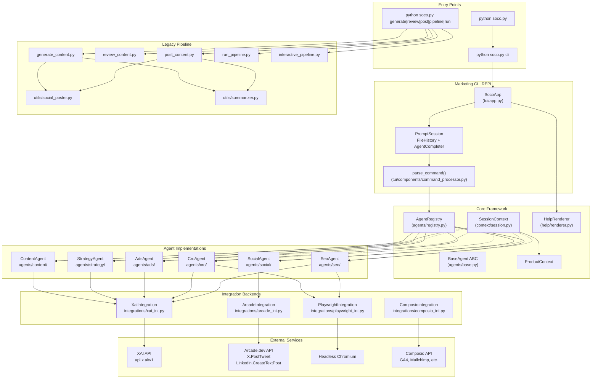
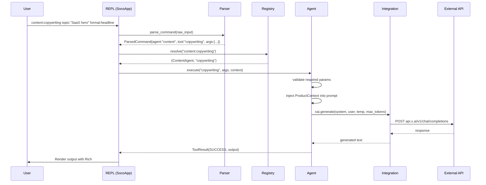
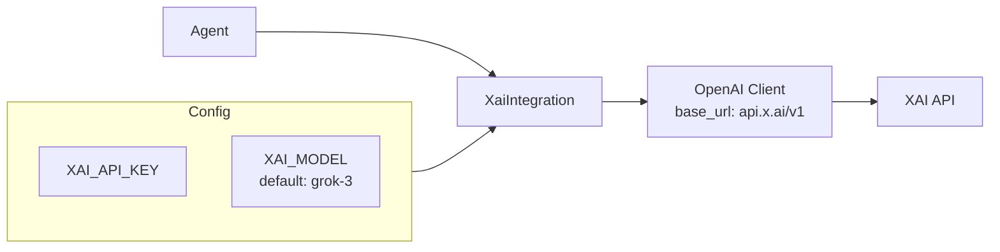
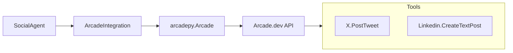
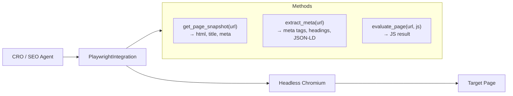
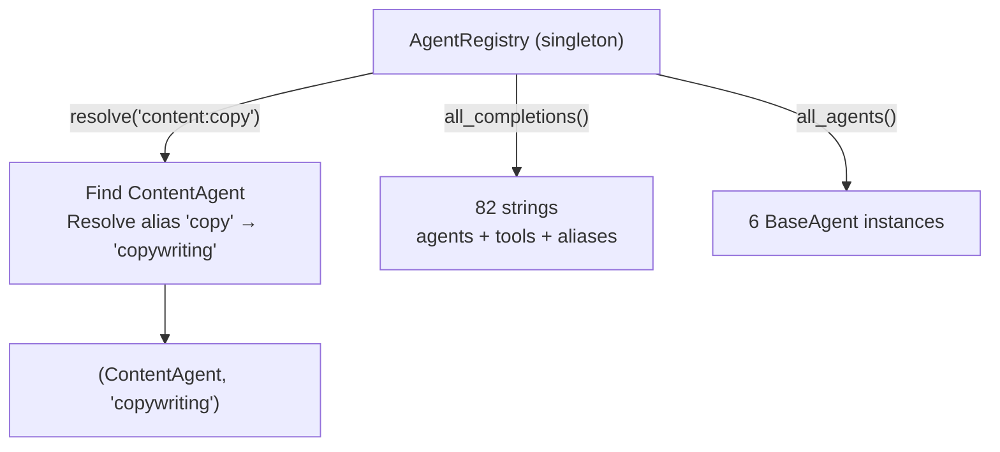
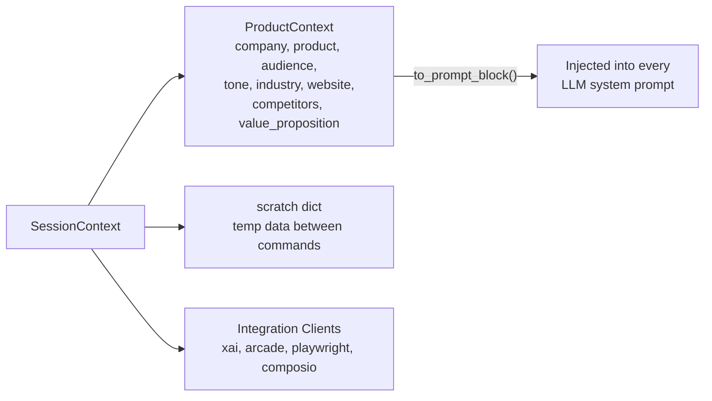
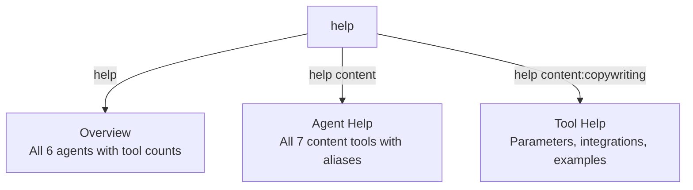
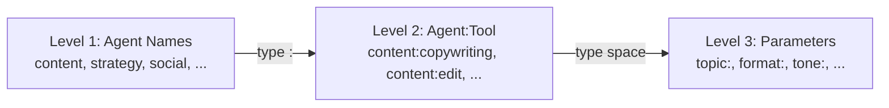
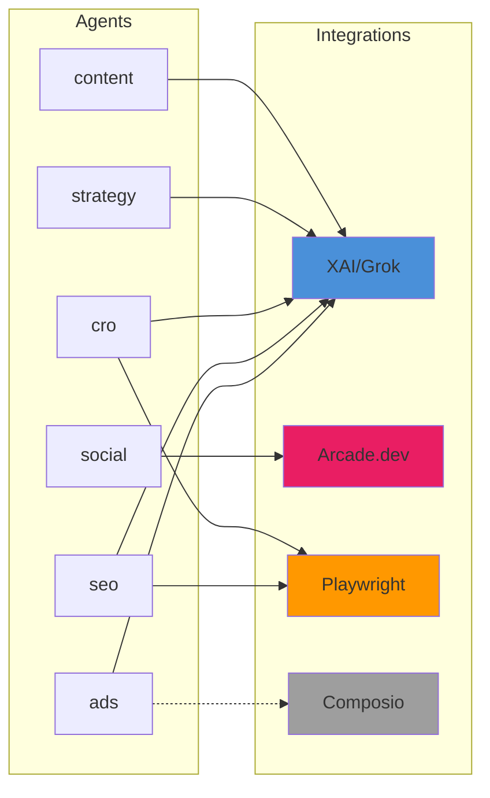

# soco Tools & Integrations

Technical reference for soco's internal architecture, integration backends, and data flow.

## System Architecture



## Request Lifecycle



## Integration Backends

### XaiIntegration

Wraps the OpenAI Python client pointed at XAI's endpoint.



| Method | Signature | Description |
|--------|-----------|-------------|
| `generate()` | `async (system, user, temperature, max_tokens) → str` | Generate text via chat completion |
| `is_configured()` | `() → bool` | True if API key is set |

**Used by**: content, strategy, cro, seo, ads

### ArcadeIntegration

Thin wrapper around the `arcadepy` SDK for social media posting.



| Method | Signature | Description |
|--------|-----------|-------------|
| `execute_tool()` | `(tool_name, inputs) → dict` | Execute an Arcade tool |
| `is_configured()` | `() → bool` | True if API key and user ID are set |

**Used by**: social

### PlaywrightIntegration

Async Playwright browser manager for page crawling and analysis.



| Method | Signature | Description |
|--------|-----------|-------------|
| `get_page_snapshot()` | `async (url) → dict` | Full page HTML + title + meta description |
| `extract_meta()` | `async (url) → dict` | Meta tags, headings (h1-h3), JSON-LD blocks |
| `evaluate_page()` | `async (url, js) → str` | Run arbitrary JS on page |
| `close()` | `async ()` | Clean up browser resources |

**Used by**: cro, seo

### ComposioIntegration

Stub wrapper for Composio SDK (GA4, Mailchimp, Semrush, etc.). Activates when `COMPOSIO_API_KEY` is set.

| Method | Signature | Description |
|--------|-----------|-------------|
| `execute_action()` | `async (action, params) → dict` | Execute a Composio action |

**Used by**: ads (analytics-tracking), seo (future), content (email-sequence via Mailchimp)

## Core Framework

### BaseAgent

Abstract base class that all agents implement.

```python
class BaseAgent(ABC):
    name: str                           # "content", "seo", etc.
    description: str                    # One-liner for help

    def get_tools() -> list[ToolDefinition]
    async def execute(tool_name, args, context) -> ToolResult
    def resolve_tool(tool_name) -> Optional[ToolDefinition]   # by name or alias
    def get_completions() -> list[str]                         # agent:tool strings
    def get_param_completions(tool_name) -> list[str]          # param keys
```

### ToolDefinition

```python
@dataclass
class ToolDefinition:
    name: str
    description: str
    long_help: str
    aliases: list[str]
    examples: list[str]
    required_integrations: list[str]
    parameters: dict[str, dict]
    # parameter dict: {"description": str, "required": bool, "default": str, "options": list}
```

### ToolResult

```python
@dataclass
class ToolResult:
    status: ToolStatus    # SUCCESS | ERROR | NEEDS_INPUT
    output: str
    data: dict
    error: str
    follow_up_prompt: str
```

### AgentRegistry

Singleton that holds all agent instances and provides resolution.



| Method | Description |
|--------|-------------|
| `get()` | Get singleton instance |
| `register(agent)` | Register an agent |
| `resolve(command)` | Parse `agent:tool` → (agent, tool_name) |
| `get_agent(name)` | Get agent by name |
| `all_completions()` | All valid autocomplete strings |
| `all_agents()` | All registered agent instances |

### SessionContext

Holds integration clients and shared state for a REPL session.



### ProductContext

Shared product context that all agents read for LLM prompt injection.

| Field | Type | Description |
|-------|------|-------------|
| `company` | str | Company name |
| `product` | str | Product name/description |
| `audience` | str | Target audience |
| `tone` | str | Default writing tone |
| `industry` | str | Industry vertical |
| `website` | str | Company website |
| `competitors` | list[str] | Competitor names |
| `value_proposition` | str | Core value proposition |
| `extra` | dict | Additional context |

Set via `strategy:product-context set company:... product:...` — persists for the session and is automatically injected into all LLM prompts.

## Command Parser

```mermaid
flowchart LR
    INPUT["'content:copy topic:\"SaaS hero\" format:headline'"]
    TOK["Tokenizer<br/>Respects quotes"]
    FIRST["First token<br/>content:copy"]
    REST["Remaining tokens<br/>key:value pairs"]
    CMD["ParsedCommand<br/>agent: content<br/>tool: copy<br/>args: {topic: SaaS hero, format: headline}"]

    INPUT --> TOK --> FIRST & REST --> CMD
```

The tokenizer handles:
- `key:value` — simple values
- `key:"multi word value"` — quoted strings
- `key:'single quoted'` — single quotes
- Builtin commands: `help`, `agents`, `context`, `history`, `clear`, `exit`

## Help System

Three levels of help, rendered with Rich markup:



## Tab Completion

The `AgentCompleter` provides 3-level prompt_toolkit completion:



82 total completions including all agent names, `agent:tool` combinations, aliases, and builtin commands.

## Agent → Integration Mapping



Solid lines = actively used. Dashed lines = planned (requires API key).

## File Reference

| File | Lines | Purpose |
|------|------:|---------|
| `agents/base.py` | ~70 | BaseAgent ABC, ToolResult, ToolDefinition, ToolStatus |
| `agents/registry.py` | ~60 | AgentRegistry singleton |
| `agents/content/__init__.py` | ~200 | ContentAgent — 7 XAI-powered tools |
| `agents/strategy/__init__.py` | ~200 | StrategyAgent — 6 tools (product-context is local) |
| `agents/social/__init__.py` | ~120 | SocialAgent — 3 tools wrapping Arcade |
| `agents/cro/__init__.py` | ~150 | CroAgent — 8 tools (Playwright + XAI) |
| `agents/seo/__init__.py` | ~220 | SeoAgent — 5 tools (Playwright + XAI) |
| `agents/ads/__init__.py` | ~130 | AdsAgent — 3 tools (XAI + Composio) |
| `integrations/xai_int.py` | ~45 | XAI wrapper (OpenAI client → x.ai) |
| `integrations/arcade_int.py` | ~45 | Arcade wrapper (arcadepy SDK) |
| `integrations/playwright_int.py` | ~90 | Async Playwright browser manager |
| `integrations/composio_int.py` | ~25 | Composio stub |
| `context/session.py` | ~90 | SessionContext + ProductContext |
| `help/renderer.py` | ~110 | 3-level Rich help renderer |
| `tui/app.py` | ~190 | SocoApp REPL + AgentCompleter |
| `tui/components/command_processor.py` | ~100 | agent:tool parser + tokenizer |
